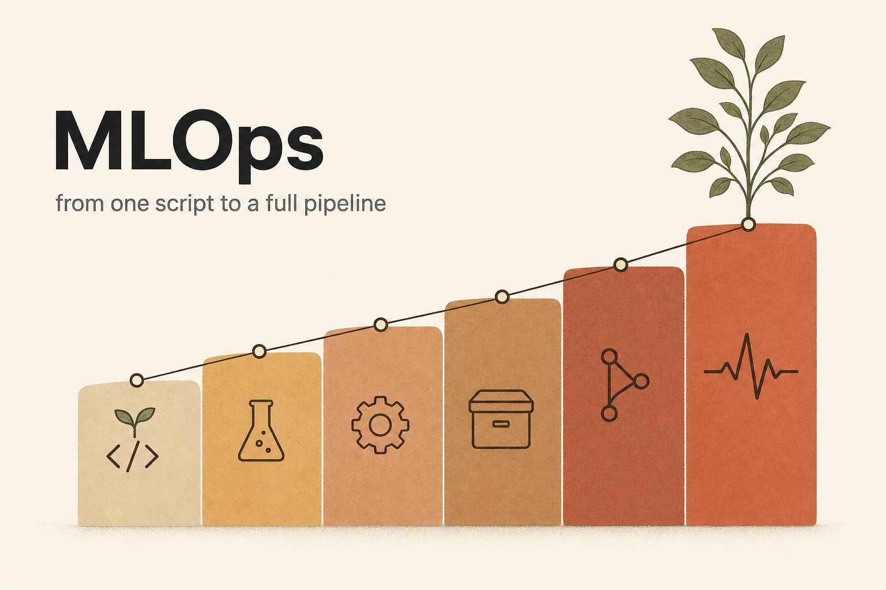

# MLOps 入門完整教學專案（12 小時 · 2026 視角）

<p align="center">
  
</p>

> 一套**循序漸進、可實作**的 MLOps 入門課程。以「**一次一工具、玩具資料先行、延後整合**」的漸進式路線，帶學員從一支純 sklearn 腳本，逐步長成一條**可追蹤、可調參、可版本化、可服務化、可自動化、可監控**的 MLOps pipeline，最後收束到一個**工業級完整專案範例**。

本專案同時包含三個層次的交付物：**課程設計文件**（怎麼教）、**教學用程式 repo**（學員動手）、**工業級 capstone 範例**（生產長相）。

---

## 這門課在解決什麼問題

傳統 MLOps 課常見兩個失敗點，本課刻意避開：

1. **一開始就攤開十幾個工具** → 學員認知超載。本課用「技能階梯」一次只引入一個工具。
2. **只教 toy demo，看不到生產長相** → 學完不知如何落地。本課最後提供一個對齊生產結構的 capstone 範例。

**設計定位（2026 視角）**：以傳統 ML 三大資料型態打穩 MLOps 骨幹，並點出 LLMOps 是同一套原則的延伸。

| 資料型態 | 實務子場景（智慧工廠紅線案例） | 模型 |
| :--- | :--- | :--- |
| 結構化 + 時序 | 設備預測性維護（感測器 → 預測故障） | XGBoost |
| 時序 | 產能需求預測 | LSTM / Prophet |
| 影像 | 產線視覺瑕疵檢測 | **PyTorch 預訓練 ResNet** + ONNX |

---

## 三層學習法：先會用 → 再會接 → 才會設計

整個課程把「學工具」和「組系統」**刻意拆成兩件事**：

```
Layer 1 單工具沙盒   modules/mN/sandbox/     孤立、玩具資料、可丟可重來   →「我在學這一個工具怎麼用」
        ↓ 玩熟了
Layer 2 漸進整合     workspace/（單一、累積） 一條逐步長大的真主線         →「我把學會的工具接到我的專案」
        ↓ 接順了
Layer 3 完整專案     capstone/                生產級完整骨架，最後才解鎖   →「我自己決定怎麼組、為什麼」
```

每一步只引入一個新工具，其餘環境都已熟悉，把注意力留給「這個工具怎麼用」。詳見 [`mlops-course/README.md`](./mlops-course/README.md) 的學習地圖。

---

## 課程大綱（6 模組 × 2 小時 = 12 小時）

| 模組 | 主題 | 引入的工具 | 技能階梯 |
| :--- | :--- | :--- | :--- |
| **M1** | 基礎與可重現心智 | Python + Git | 階 0 |
| **M2** | 實驗追蹤 · 自動調參 · 版本化 | **MLflow + Optuna + DVC** | 階 1–3 |
| **M3** | 特徵工程與特徵商店 | **Feast**（point-in-time） | 階 4 |
| **M4** | 模型打包與服務化 | **Docker · FastAPI · BentoML · PyTorch/ONNX** | 階 5–8 |
| **M5** | CI/CD/CT 自動化與編排 | **Prefect · GitHub Actions** | 階 9–10 |
| **M6** | 監控 · 漂移偵測 · 治理 | **Evidently** + Model Card + EU AI Act | 階 11 |

> 完整逐節大綱（學習目標／核心觀念／Lab／對應趨勢）見 [`docs/mlops-course-outline.md`](./docs/mlops-course-outline.md)。

---

## 倉庫結構

```
.
├── README.md                 ← 你在這裡（專案門面）
├── docs/                     課程設計文件（怎麼教、怎麼開發）
│   ├── mlops-course-outline.md      12h 課程大綱（觀念骨架）
│   ├── teaching-progression.md      漸進式教學原則（三層學習法、技能階梯）
│   ├── teaching-repo-structure.md   教學 repo 資料夾設計（依學習順序）
│   ├── project-structure.md         工業級生產 repo 結構（依架構）
│   └── development-wbs.md            教材＋程式開發 WBS（工時、里程碑）
│
└── mlops-course/             ★ 教學用程式 repo（學員動手）
    ├── README.md                    學習地圖
    ├── SETUP.md                     環境安裝
    ├── datasets/                    共用玩具資料（iris / diabetes / toy_sensors）
    ├── modules/m1…m6/               6 模組：README（五段）+ sandbox 可跑範例
    ├── workspace/                   Layer 2 漸進整合主線
    ├── checkpoints/                 各模組救援快照（after-m1…m5）
    └── capstone/smart-factory-mlops/  ★ Layer 3 工業級完整專案範例（102 檔）
```

---

## 工業級 Capstone 範例：`smart-factory-mlops`

`mlops-course/capstone/smart-factory-mlops/` 是一個**對齊生產結構**的完整專案範例（102 檔），可當作落地 MLOps 的起手骨架：

- **config-driven**：`conf/`（data / model / train / hpo）集中設定，切資料集與超參只改 YAML
- **三模型線**：`src/models/{tabular,timeseries,vision}` 共用同一套訓練/追蹤/服務骨架
- **全鏈路**：DVC 版本化 → Feast 特徵 → MLflow + Optuna 訓練調參 → BentoML 服務 → Prefect 編排 → GitHub Actions CI/CD → Evidently 監控
- **治理就緒**：Model Card、Datasheet、EU AI Act 風險評估
- **可部署**：`docker/`（compose）、`infra/terraform/`、`.pre-commit`、`tests/`（unit/integration/data）

> 完整結構規格見 [`docs/project-structure.md`](./docs/project-structure.md)。

---

## 技術棧（2026）

| 階段 | 主工具 | 備選 |
| :--- | :--- | :--- |
| 版本控制 | Git + **DVC** | LakeFS、Delta Lake |
| 實驗追蹤 | **MLflow** | W&B、Neptune |
| 自動調參 / AutoML | **Optuna** | Ray Tune、W&B Sweeps、FLAML |
| 特徵商店 | **Feast** | Tecton、Featureform |
| 服務化 | **BentoML** | Triton、KServe、Ray Serve |
| 編排 | **Prefect** | ZenML、Airflow、Kubeflow |
| CI/CD | **GitHub Actions** | GitLab CI |
| 監控 | **Evidently** | Arize、WhyLabs |
| 容器 | **Docker** | Kubernetes（進階） |

---

## 快速開始

**學員（跟著學）**
```bash
cd mlops-course
# 1. 讀 SETUP.md 裝環境（Python 3.11；建議 uv 或 conda）
# 2. 從 M1 開始，每個模組先跑 sandbox 再回 workspace 整合
cat modules/m1-foundations/README.md
python modules/m1-foundations/sandbox/01_baseline_iris.py
```

**想直接看生產長相（capstone）**
```bash
cd mlops-course/capstone/smart-factory-mlops
cat README.md
make help          # 看可用指令（train / tune / serve / test / monitor …）
```

**講師 / 課程開發者**
> 先讀 `docs/` 五份設計文件；開發排程與工時見 [`docs/development-wbs.md`](./docs/development-wbs.md)。

---

## 給不同讀者的入口

| 你是 | 從這裡開始 |
| :--- | :--- |
| 想學 MLOps 的工程師 / 資料科學家 | [`mlops-course/README.md`](./mlops-course/README.md) → M1 |
| 想看生產級專案範例 | [`mlops-course/capstone/smart-factory-mlops/`](./mlops-course/capstone/smart-factory-mlops/) |
| 要備課的講師 | [`docs/mlops-course-outline.md`](./docs/mlops-course-outline.md) + [`docs/teaching-progression.md`](./docs/teaching-progression.md) |
| 想了解教學設計理念 | [`docs/teaching-progression.md`](./docs/teaching-progression.md)（為何漸進式） |

---

## 授權

見 [`LICENSE`](./LICENSE)。課程使用的公開資料集（NASA C-MAPSS、MVTec AD、Pima Diabetes 等）各依其原始授權。
