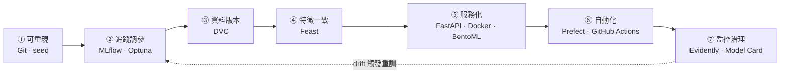

# MLOps 全流程入門 · 2 小時簡報大綱

> **產出目的**：這份文件是投影片的**設計稿**，不是投影片本身。每一頁都標了「版面型別／要點／講稿提示／教材出處」，可直接交給設計或自行套版。
> **教材來源**：`mlops-course/modules/m1…m6/README.md` + 各模組 `sandbox/`
> **版本**：v1 · 2026-08-01

---

## 0. 設計前提（先對齊，再看內容）

| 項目 | 決定 |
| :--- | :--- |
| 場景 | 獨立的 2 小時 MLOps 全流程概論，**不動手實作** |
| 聽眾 | 會 Python / sklearn，跑得動 `train_test_split`，但沒用過 MLflow / Docker / CI |
| 模型深度 | 帶到「生命週期 + 超參數 + 評估指標」的直覺，**不推導任何演算法** |
| 總張數 | 54 張 |
| 時間 | 100 分鐘實講 + 10 分鐘 Q&A + 10 分鐘休息（Ch3 後） |
| 後續 | 這場是 12 小時實作課的前導；結尾要能無縫接上 |

### 敘事主軸：一支腳本的災難之旅

整場只講一個故事——**一支 `train.py`，在七個地方被現實打臉，每一次打臉引出一個工具**。

```
train.py 訓出 0.94
   ↓ 打臉 1：明天再跑，變成 0.91        → 可重現（seed + Git）
   ↓ 打臉 2：試了 40 組超參，忘了哪組最好 → MLflow + Optuna
   ↓ 打臉 3：程式碼回到上週，資料卻是今天 → DVC
   ↓ 打臉 4：離線 0.94，上線崩到 0.79     → Feast / point-in-time
   ↓ 打臉 5：PM 要一個網址，你只有 .pkl   → FastAPI + Docker + BentoML
   ↓ 打臉 6：每次重訓都要人記得           → Prefect + GitHub Actions
   ↓ 打臉 7：沒報錯，但已經爛了半年       → Evidently + 治理
```

工具是**答案**，不是清單。這是刻意選擇——教材 README 明講傳統 MLOps 課的第一個失敗點就是「一開始就攤開十幾個工具」。

### 全景地圖（progressive reveal 機制）

第 4 頁給出完整地圖，**七格全灰**。之後每章結束回到這張圖，**點亮一格**。第 51 頁全亮。

聽眾任何時候抬頭都知道自己在哪——這解決了痛點驅動敘事唯一的缺點（容易迷路），又不違反「一次一工具」。

地圖建議用 mermaid 產生後轉圖檔，七格對應七個章節：



> 注意那條**虛線回箭頭**（⑦ → ②）。它是整張圖的靈魂：MLOps 不是一條直線，是一個**閉環**。第 4 頁就要畫出來，第 51 頁再回收。

### 版面型別（全場只用 6 種，維持節奏）

| 代號 | 型別 | 用法 | 張數 |
| :--- | :--- | :--- | ---: |
| **A** | 金句頁 | 深底、一句大字（≤ 14 字）、無其他元素 | 9 |
| **B** | 全幅圖頁 | 一張圖佔滿，標題壓左上角 | 6 |
| **C** | 圖左文右 | 左 60% 圖／流程，右 40% 三個要點 | 12 |
| **D** | 對照表頁 | 2–4 欄表格，教材原生表格直接搬 | 17 |
| **E** | 程式碼頁 | ≤ 10 行 code + 右側「這行在幹嘛」 | 3 |
| **F** | 地圖點亮頁 | 全景圖，本章格亮、其餘灰 | 7 |
| | | **合計** | **54** |

> **D 佔了 31%，是刻意的。** 教材本身高度表格化（打包格式、CI/CD/CT、監控四層、三種漂移…），這些內容的本質就是**對照**，硬改成流程圖反而失真。代價是視覺容易單調——用 P4 之後每章的 A 頁（深底大字）與 F 頁（地圖）打斷節奏來補償。若表格頁連續超過兩張，就把其中一張降級成口頭補充。

### 每章固定四拍節奏

```
A 痛點金句  →  B/C 概念圖  →  D/E 工具最小動詞  →  F 地圖點亮
   「爽」        「懂」          「會認」            「知道在哪」
```

大章（Ch2、Ch4）節奏重複兩輪。聽眾第三章就會建立預期，注意力成本大幅下降。

---

## 1. 時間分配總表

| 章 | 標題 | 頁碼 | 張數 | 分鐘 | 累計 | 教材源 |
| :--- | :--- | :--- | ---: | ---: | ---: | :--- |
| 開場 | 你的模型訓好了，然後呢？ | 1–4 | 4 | 8 | 8 | 專案 README |
| **Ch0** | **模型到底在做什麼** | 5–10 | 6 | 12 | 20 | M1 · M2 · M3 |
| Ch1 | 可重現：一切的地基 | 11–15 | 5 | 12 | 32 | M1 |
| Ch2 | 追蹤 · 調參 · 資料版本 | 16–24 | 9 | 20 | 52 | M2 |
| Ch3 | 特徵：訓練/服務一致 | 25–30 | 6 | 14 | 66 | M3 |
| — | ☕ 休息 | — | — | 10 | 76 | — |
| Ch4 | 服務化：讓別人叫得到 | 31–37 | 7 | 14 | 90 | M4 |
| Ch5 | 自動化：讓它自己跑 | 38–43 | 6 | 14 | 104 | M5 |
| Ch6 | 上線後：盯著它 | 44–50 | 7 | 14 | 118 | M6 |
| 收尾 | 地圖全亮 + 第一週做什麼 | 51–54 | 4 | 8 | 126 | — |
| — | Q&A | — | — | 10 | 136 | — |

> **超時保險**：若進度落後，Ch4 的 P35（BentoML 選型）與 Ch5 的 P43（canary/blue-green）可各砍 3 分鐘，這兩頁是「知道有這件事」等級，不影響主線。**絕不要砍 Ch3**——那是全場記憶點最高的一章。

---

## 2. 逐頁設計

---

### 開場 · 你的模型訓好了，然後呢？（P1–P4，8 分鐘）

---

**P1 · 封面**
- **版面**：B（全幅圖）
- **主標**：從一支腳本，到一條會自己跑的 pipeline
- **副標**：MLOps 全流程入門 · 2 小時
- **視覺**：直接用 `docs/assets/mlops-hero.png`
- **講稿**：不要在封面講話超過 20 秒。直接進 P2。

---

**P2 · 一個提問**
- **版面**：A（金句頁）
- **主文**：你的 notebook 訓出 accuracy 0.94。<br>**然後呢？**
- **講稿提示**：舉手互動——「有多少人的模型最後停在 notebook 裡？」通常過半數會笑。這一刻就建立了整場的共鳴基礎。停 5 秒再翻頁。
- **教材出處**：專案 README「這門課在解決什麼問題」

---

**P3 · 兩個失敗現場**
- **版面**：D（對照表，兩欄並排）
- **內容**：

| 現場一：模型死在 notebook | 現場二：模型死在線上 |
| :--- | :--- |
| 訓好了，指標很漂亮 | 上線了，PM 每天在用 |
| 交接時沒人跑得起來 | 半年後有人問「這數字對嗎」 |
| 三個月後你自己也忘了怎麼跑 | 一查，模型從三月起就在亂猜 |
| **從來沒上線** | **沒有任何錯誤訊息** |

- **講稿提示**：第二個現場更可怕——「**它不會報錯**。一個爛掉的模型不會 crash，它只會安靜地給你錯的答案。」這句話會在 P44 回收。
- **教材出處**：M6 README 1.1 監控四層的動機

---

**P4 · 今天的地圖**
- **版面**：F（地圖，七格**全灰**）
- **內容**：全景 pipeline 圖 + 虛線回箭頭
- **講稿提示**：
  - 「今天不是要教你這七個工具怎麼用——2 小時做不到，那是後面 12 小時的事。」
  - 「今天要讓你知道**每一格在解決什麼問題**，這樣你以後看到任何 MLOps 工具，都能問一句：它在補哪一格？」
  - 手指那條虛線：「特別注意這條回頭的線。MLOps 不是一條直線，是一個**閉環**——這是它和一般軟體工程最大的差別。」
- **教材出處**：`docs/assets/mlops-learning-path.png` 的重新編排

---

### Ch0 · 模型到底在做什麼（P5–P10，12 分鐘）

> **本章定位**：把「模型邏輯」一次講完，之後六章不再回頭。目標是讓聽眾在 Ch2 聽到「調參」、Ch3 聽到「AUC 虛高」時，腦中有東西可以掛。
> **紀律**：不出現任何損失函數、梯度、機率分布公式。一條公式都不要。

---

**P5 · 模型 = 一組被資料調出來的參數**
- **版面**：C（圖左文右）
- **左圖**：極簡三方塊 —— `輸入 x` → `[ f ]` → `輸出 y`，`f` 下方標「一組數字（參數）」
- **右側三點**：
  1. 訓練 = 拿一堆已知的 (x, y)，去**調** f 裡面那組數字
  2. 調到什麼時候停？調到 f 猜得夠準為止
  3. 「模型檔案」（`.pkl`）裡面存的，就是那組調好的數字
- **講稿提示**：「所以模型不是程式碼，是**資料的產物**。這句話是後面所有麻煩的根源——你的 Git 管得住程式碼，管不住資料，也就管不住模型。」
- **教材出處**：M1 `01_baseline_iris.py`

---

**P6 · 為什麼要切 train / test**
- **版面**：C（圖左文右）
- **左圖**：一條資料橫條，切成 80% 藍（train）/ 20% 橘（test）；下方兩個小人：一個在「唸書」，一個在「考試」
- **右側三點**：
  1. 拿考古題訓練，再用**同一份**考古題考試 → 分數當然高，但你不知道他會不會
  2. 所以 accuracy 一定要算在 **test** 上
  3. 訓練分數高、測試分數低 = **過擬合**（背答案，不會舉一反三）
- **講稿提示**：「這是全場唯一一個你們大概都已經知道的觀念。我還是要講，因為 Ch3 那個最戲劇化的翻車，本質上就是**測試資料偷看到答案**——只是偷看的方式陰險得多。」
- **教材出處**：M1 README 檢核題 2

---

**P7 · 參數 vs 超參數（埋 Optuna 伏筆）**
- **版面**：D（對照表）
- **內容**：

| | 參數（parameter） | 超參數（hyperparameter） |
| :--- | :--- | :--- |
| 誰決定的 | **模型自己**從資料學 | **你**在訓練前決定 |
| 例子 | 每個特徵的權重 | `C=1.0`、`max_iter=200`、樹的深度 |
| 什麼時候定 | 訓練過程中不斷調整 | 訓練**開始前**就要填好 |
| 你能做什麼 | 什麼都不用做 | **只能試** —— 試不同組合，看哪組好 |

- **講稿提示**：重點敲最後一格——「超參數沒有公式可以算出最佳值，**只能試**。這件事看起來很笨，但它就是笨。而既然是笨工作，就該給機器做——這是 Ch2 Optuna 存在的全部理由。」
- **教材出處**：M2 `sandbox/optuna/01_objective_basic.py`

---

**P8 · accuracy 什麼時候會騙你**
- **版面**：C（圖左文右）
- **左圖**：一個極度不平衡的圓餅圖 —— 良品 99% / 不良 1%
- **右側**：
  - 「我的瑕疵檢測模型 accuracy 有 **99%**」
  - 一支永遠回答「良品」的程式，accuracy 也是 99%
  - 而它**一個瑕疵都抓不到**
  - → 類別不平衡時，accuracy 是**沒有資訊量**的指標
- **講稿提示**：這一頁要慢。「所以工廠場景幾乎不看 accuracy——因為不良率本來就低。」
- **教材出處**：M1 `00_eda_iris.ipynb`（類別平衡決定 accuracy 能不能用）

---

**P9 · AUC 在看什麼（一張圖講完）**
- **版面**：B（全幅圖）
- **視覺**：一條 ROC 曲線 + 對角虛線。左下標「亂猜 = 0.5」，左上角標「完美 = 1.0」
- **文字（僅三行，壓在圖右）**：
  - AUC 在問：**模型有沒有把該抓的排在前面**
  - 0.5 = 跟丟銅板一樣
  - 不受類別不平衡影響 → 這是它取代 accuracy 的原因
- **講稿提示**：「不用管它怎麼算出來的。你只要記住**這條線越往左上凸越好**，以及**0.5 等於沒本事**。記住這兩件事，Ch3 那張圖你就看得懂了——那是今天最值得記住的一張圖。」
- **教材出處**：M3 `02_leakage_viz.ipynb`（此頁為其前置鋪陳）

---

**P10 · 三種資料，同一套骨架**
- **版面**：D（三欄對照表）
- **內容**：

| 資料型態 | 工廠場景 | 常用模型 | 打包成 |
| :--- | :--- | :--- | :--- |
| 結構化 + 時序 | 設備預測性維護（感測器 → 預測故障） | **XGBoost** | pickle |
| 純時序 | 產能需求預測 | **LSTM / Prophet** | pickle / TorchScript |
| 影像 | 產線視覺瑕疵檢測 | **預訓練 ResNet** | **ONNX** |

- **底部一行大字**：**模型換了，但後面六章的每一格都不變。**
- **講稿提示**：本章收束句——「這就是為什麼 MLOps 值得學：它是**跨模型、跨場景通用**的骨架。你今天學的東西不會因為換模型就作廢。順帶一提，LLM 也是同一套原則的延伸——只是把『模型』換成『提示詞 + 模型 + 檢索』。」
- **教材出處**：專案 README「設計定位（2026 視角）」表格

---

### Ch1 · 可重現：一切的地基（P11–P15，12 分鐘）

---

**P11 · 痛點**
- **版面**：A（金句頁）
- **主文**：同一支腳本，<br>今天 0.94，明天 0.91。
- **副文（小字）**：你什麼都沒改。
- **講稿提示**：「舉手——有人遇過嗎？」這是全場第二個互動點。
- **教材出處**：M1 README「驗收重點：把腳本跑兩次，accuracy 必須一模一樣」

---

**P12 · 隨機性從哪裡混進來**
- **版面**：C（圖左文右）
- **左圖**：`train.py` 方塊，三支箭頭指進去，各標一個隨機源
- **右側**：
  1. `train_test_split` —— 每次切的位置不一樣
  2. 模型初始化 —— 起始參數是隨機的
  3. 資料順序 / 執行緒排程
  - → 解法只有一個字：**seed**
- **底部程式碼（單行）**：`train_test_split(X, y, test_size=0.2, random_state=42)`
- **講稿提示**：「`random_state=42` 這行，是整條 MLOps pipeline 的第一塊磚。少了它，後面所有的追蹤、比較、稽核**全部沒有意義**——因為你比較的兩個數字，差異可能只是運氣。」
- **教材出處**：M1 `01_baseline_iris.py`

---

**P13 · Git：只要四個動詞**
- **版面**：D（對照表）
- **內容**：

| 動詞 | 一句話 | 什麼時候用 |
| :--- | :--- | :--- |
| `git status` | 我現在改了什麼 | 動手前後都先看一眼 |
| `git branch <name>` | 開一條功能分支 | 開始新任務時 |
| `git add <file>` | 選要納管的檔案 | commit 前挑 |
| `git commit -m "..."` | 存成一個版本 | 完成一個可獨立 review 的小步 |

- **底部紅框大字**：**鐵律：先開分支，再動程式碼。永遠不要在 `main` 上直接改。**
- **講稿提示**：「commit message 用祈使句，講清楚 **WHY** 不是 WHAT。想像一個沒看過這個 repo 的人在讀——三個月後那個人就是你自己。」
- **教材出處**：M1 README「極簡 Git 工作流 cheatsheet」（逐字可搬）

---

**P14 · notebook 還是 script？（教材招牌觀點）**
- **版面**：D（對照表）
- **內容**：

| | notebook | script |
| :--- | :--- | :--- |
| 誰在用 | **人**，互動式 | **機器**，無人值守 |
| 目的 | 看懂資料長什麼樣 | 產出今天/明天/別人跑都一樣的數字 |
| 強在哪 | 理解來自**看見** | 從頭到尾、順序固定 |
| 弱在哪 | **亂序執行** | 看不到圖 |

- **底部一行大字**：**人在看資料 → notebook；機器無人值守在跑 → 檔案。**
- **講稿提示**：「這不是品味問題，是**介質選擇**。notebook 最有名的失敗模式就是亂序執行——你用一個會給出不同答案的工具，去做『每次都要一樣』這件事，訊息本身就自我矛盾。」
- **教材出處**：M1 README 2-0；完整判準見 `docs/notebook-vs-script.md`

---

**P15 · 地圖點亮 ①**
- **版面**：F
- **亮起**：① 可重現（Git · seed）
- **一行總結**：**沒有可重現，後面六格全部是幻覺。**

---

### Ch2 · 追蹤 · 調參 · 資料版本（P16–P24，20 分鐘）

> 本章最重，走**兩輪四拍**：P16–P20 追蹤與調參，P21–P23 資料版本。

---

**P16 · 痛點**
- **版面**：A（金句頁）
- **主文**：`model_final_v3_really_final.pkl`
- **副文（小字）**：它的超參數是什麼？誰記得？
- **講稿提示**：全場笑點最高的一頁。笑完接一句：「還有一個更慘的版本——**Excel**。有人用試算表記超參數嗎？」
- **教材出處**：M2 README 動機

---

**P17 · MLflow：三個動詞**
- **版面**：E（程式碼頁）
- **程式碼**：

```python
with mlflow.start_run(run_name="first-run"):
    model.fit(X_train, y_train)
    acc = accuracy_score(y_test, model.predict(X_test))

    mlflow.log_param("C", C)              # 記「輸入」
    mlflow.log_metric("accuracy", acc)    # 記「輸出」
    mlflow.log_model(model, "model")      # 記「產物」
```

- **右側對照（三行）**：
  - `log_param` → 這次**用了什麼**超參
  - `log_metric` → 這次**跑出什麼**成績
  - `log_model` → 這次**產出哪個**模型檔
- **講稿提示**：「就三個動詞。你今天記住這三個字，MLflow 就有 80% 會用了。剩下 20% 是 UI 上點一點的事。」
- **教材出處**：M2 `sandbox/mlflow/01_first_run.py`（逐字）

---

**P18 · MLflow UI：實驗變成可比較的表**
- **版面**：B（全幅圖）
- **視覺**：MLflow UI 實際截圖（experiment 列表，多個 run 並排，metric 欄可排序）
- **標註（紅圈三處）**：① experiment 名稱 ② 每列一個 run ③ metric 欄可排序
- **講稿提示**：「看到這張表，你就懂為什麼要記了——**實驗從此可以被排序**。你不再需要記得哪組最好，你用點的。」
- **教材出處**：M2 README 2-1 `mlflow ui`

---

**P19 · 痛點二 + Optuna**
- **版面**：C（圖左文右）
- **左圖**：組合爆炸示意 —— `C` 5 個值 × `max_iter` 5 個值 × `solver` 2 個值 = **50 次訓練**；旁邊一個崩潰小人
- **右側程式碼（4 行，貼緊）**：

```python
def objective(trial):
    C = trial.suggest_float("C", 1e-3, 1e2, log=True)
    ...
    return cross_val_score(model, X_train, y_train, cv=5).mean()

study = optuna.create_study(direction="maximize")
study.optimize(objective, n_trials=20)
```

- **右側三點**：
  1. 你只寫「**範圍**」，不寫「試哪些值」
  2. Optuna 從前面的結果**學**下一組該試什麼（不是暴力窮舉）
  3. `pruning`：爛 trial 提早砍掉，不浪費預算
- **講稿提示**：「注意 `n_trials=20` 就找到好結果，而網格搜尋要 50 次。差別在 Optuna **會學**——它看前面 5 次的成績，決定第 6 次往哪找。」
- **教材出處**：M2 `sandbox/optuna/01_objective_basic.py`、`03_pruning_asha.py`

---

**P20 · ★ 本章靈魂：每個 trial = 一個 run**
- **版面**：B（全幅圖）
- **視覺**：MLflow UI 的 nested run 截圖 —— 一個 parent run 展開，底下 20 個 child run
- **中央大字（壓在圖上）**：**每個 Optuna trial = 一個 MLflow run**
- **右下三行**：
  - Optuna 負責**自動產生**大量實驗
  - MLflow 負責**記錄並比較**這些實驗
  - 兩者合起來 = **AutoML 的引擎**
- **講稿提示**：這是 Ch2 唯一必須記住的一頁。「先有 MLflow 才有地方記 trial，再有 Optuna 才有東西自動產生大量 run。這兩個工具不是並列關係，是**互補**——這也是為什麼教材把它們放在同一個模組。」
- **教材出處**：M2 README「本模組的靈魂」（逐字）

---

**P21 · 痛點三**
- **版面**：A（金句頁）
- **主文**：`git checkout` 回到上週的程式碼，<br>資料卻還是今天的。
- **副文（小字）**：於是你永遠重現不出上週那個 0.94。
- **教材出處**：M2 README 檢核題 5

---

**P22 · DVC：把資料的指紋交給 Git**
- **版面**：C（圖左文右）
- **左圖**：兩層對照 ——
  - 上層：`Git` 方塊 → 管 `train.py`（小檔，文字）
  - 下層：`DVC` 方塊 → 管 `data.csv`（大檔，二進位）
  - 中間一條線：`data.csv.dvc`（一個只有幾行的**指紋檔**）被 Git 管著
- **右側**：
  1. 大檔進不了 Git（也不該進）
  2. DVC 把資料存到別處，只把**指紋**（hash）留給 Git
  3. 於是 `git checkout` + `dvc checkout` → 程式碼和資料**一起**回到那一版
- **底部一行**：`dvc init` → `dvc add` → `dvc push` → `dvc checkout`
- **講稿提示**：「關鍵是**兩個 checkout 要成對**。只做 `git checkout`，你拿到的是舊程式碼配新資料——那是最糟的組合，因為它會跑，只是結果不對。」
- **教材出處**：M2 README 2-3

---

**P23 · 三個工具，三個問題**
- **版面**：D（對照表，本章總結）
- **內容**：

| 工具 | 階 | 它回答的問題 | 最小動詞 |
| :--- | :--- | :--- | :--- |
| **MLflow** | 1 | 這次實驗記在哪？ | `start_run` / `log_param` / `log_metric` / `log_model` |
| **Optuna** | 2 | 最好的超參是哪組？ | `create_study` / `objective` / `optimize` / `best_params` |
| **DVC** | 3 | 這版程式碼配哪版資料？ | `init` / `add` / `push` / `checkout` |

- **講稿提示**：「三個工具、十二個動詞。這就是 M2 的全部。」

---

**P24 · 地圖點亮 ②③**
- **版面**：F
- **亮起**：② 追蹤調參、③ 資料版本
- **一行總結**：**實驗可比較、資料可回溯——你的模型第一次有了「來歷」。**

---

### Ch3 · 特徵：訓練/服務一致（P25–P30，14 分鐘）

> **全場記憶點最高的一章。** 不要趕，不要砍。這一章結束後休息 10 分鐘，讓它沉澱。

---

**P25 · 痛點**
- **版面**：A（金句頁）
- **主文**：離線 AUC **0.94**。<br>上線後 **0.79**。
- **副文（小字）**：模型沒有變。資料也沒有變。
- **講稿提示**：停 5 秒不要說話。「這是所有 MLOps 事故裡最經典、也最難自己發現的一種。因為在你上線之前，**所有指標都告訴你一切正常**。」
- **教材出處**：M3 README「錯誤做法 → 指標虛高」

---

**P26 · 時間穿越：一張圖講完**
- **版面**：B（全幅圖）— **本章核心圖**
- **視覺**：一條水平時間軸
  - 中間一條垂直紅線標 **T（你要預測的時刻）**
  - T **左邊**若干綠點：標「上線時你真的拿得到的讀值」
  - T **右邊**一個紅叉：標「未來才量到的值 —— 你不該有它」
  - 錯誤 join 的箭頭：從紅叉一路彎回 T 左邊的訓練列
- **講稿提示**：
  - 「無時間概念的 join，就是把整張特徵表直接貼上標籤表。它不會報錯，它只是**悄悄把未來拌進訓練集**。」
  - 「模型於是偷看到答案。離線指標當然漂亮——但上線那一刻，紅叉那筆資料**還不存在**。」
- **教材出處**：M3 `sandbox/01_point_in_time_demo.py` 註解、`02_leakage_viz.ipynb` 時間軸圖

---

**P27 · ★ 全場最強的一張數字**
- **版面**：B（全幅圖）
- **視覺**：兩條 ROC 曲線疊圖
  - 紅線（洩漏版）：**AUC 0.940**
  - 綠線（正確版）：**AUC 0.791**
  - 中間標註：**虛高 +0.149（19%）**
- **底部大字**：**離線指標變差，不是退步——是終於誠實。**
- **講稿提示**：
  - 「這是教材裡跑出來的真實數字，不是我編的。」
  - 「請注意綠線**不是 0.5**。它還有 0.79，那是**真訊號**——來自機台的長期水準差異。所以修好洩漏之後模型仍然有用，只是不再吹牛。」
  - 「如果你今天只帶走一張投影片，帶這張。因為一個 0.94 的假模型，比一個 0.79 的真模型**危險得多**——你會拿它去做決策。」
- **教材出處**：M3 README 2-1（AUC 0.940 vs 0.791，虛高 19%）

---

**P28 · 正確做法：point-in-time join**
- **版面**：D（對照表）
- **內容**：

| | 錯誤：無時間概念的 join | 正確：point-in-time join |
| :--- | :--- | :--- |
| 怎麼做 | 整張特徵表直接 join 標籤表 | 只取「事件時間 ≤ 標籤觀測時刻」且仍在 **ttl** 內的最新特徵 |
| 訓練集 | 混進未來才量到的特徵 | 只含「當下真的拿得到」的特徵 |
| 離線指標 | **虛高**，看起來超棒 | 誠實，接近上線真實表現 |
| 上線後 | 拿不到未來特徵 → **崩盤** | 訓練/服務一致，表現穩定 |

- **講稿提示**：「關鍵字是 `event_timestamp`。你的離線資料表**一定要有這一欄**，否則這件事根本做不到——時間資訊一旦在建表時就丟了，事後補不回來。」
- **教材出處**：M3 README 第 1 節表格（逐字可搬）

---

**P29 · Feast：訓練和服務讀同一份定義**
- **版面**：C（圖左文右）
- **左圖**：
  ```
              feature_definition.py
                （唯一的定義）
                   /        \
     get_historical_features   get_online_features
        （訓練 · 離線）           （推論 · 線上）
              ↑                        ↑
          parquet 檔              sqlite / Redis
                    ↖ materialize ↗
  ```
- **右側四個最小動詞**：
  1. `feast apply` —— 登記特徵定義
  2. `get_historical_features` —— 組訓練集（**帶 point-in-time**）
  3. `materialize` —— 把最新特徵搬到線上
  4. `get_online_features` —— 線上秒查
- **講稿提示**：「特徵商店要解決的不是『存特徵』，是『**在正確的時間點、給訓練和服務同一套特徵**』。所以它值錢的不是那個資料庫，是那份**唯一的定義**。」
- **教材出處**：M3 README 第 1 節心法 + 2 節四動詞

---

**P30 · 地圖點亮 ④**
- **版面**：F
- **亮起**：④ 特徵一致（Feast）
- **一行總結**：**訓練看到的世界，必須等於上線看到的世界。**
- **翻頁後**：☕ 休息 10 分鐘

---

### Ch4 · 服務化：讓別人叫得到（P31–P37，14 分鐘）

---

**P31 · 痛點**
- **版面**：A（金句頁）
- **主文**：PM 說：「給我一個網址就好。」<br>你手上只有一個 `.pkl`。
- **教材出處**：M4 README 第 1 節

---

**P32 · 模型要存成什麼格式**
- **版面**：D（對照表）
- **內容**：

| 格式 | 一句話 | 取捨 |
| :--- | :--- | :--- |
| **pickle / joblib** | sklearn 等的原生序列化 | 簡單，但**綁死 Python + 同版套件** |
| **TorchScript** | PyTorch 計算圖序列化 | 脫離 Python 原始碼，仍在 PyTorch 生態 |
| **ONNX** | 開放標準中間表示 | 跨框架/語言、好量化、多硬體；算子偶有覆蓋限制 |

- **講稿提示**：「pickle 那個『綁死同版套件』要特別小心——你用 sklearn 1.3 存的檔，在 1.5 的環境**可能載不回來**。這是實務上最常見的部署地雷之一，也是下一頁 Docker 存在的理由。」
- **教材出處**：M4 README「打包格式（Serialization）」（逐字可搬）

---

**P33 · FastAPI：一個端點就夠**
- **版面**：E（程式碼頁）
- **程式碼**：

```python
class IrisFeatures(BaseModel):        # 在邊界驗證外部輸入
    sepal_length: float = Field(..., ge=0)
    ...

@app.post("/predict")
def predict(features: IrisFeatures):
    model = ml_models["iris"]         # 啟動時載入，不是每次請求載入
    return {"class_name": ...}
```

- **右側三點**：
  1. 模型在**啟動時**載入一次 —— 訓練一次、服務多次
  2. Pydantic 在**系統邊界**驗證輸入 —— 少傳、型別錯直接擋掉
  3. 路由函式只做三件事：解析 → 呼叫模型 → 回 JSON
- **講稿提示**：「最常見的初學者錯誤是**在請求裡面重訓模型**。那不叫服務，那叫每次都重來一遍。」
- **教材出處**：M4 `sandbox/01_fastapi/app.py`

---

**P34 · Docker：不改程式，換環境**
- **版面**：C（圖左文右）
- **左圖**：容器示意
  - 一個大方框 = container，內含 `Python 3.11 + sklearn 1.3 + app.py + model.pkl`
  - 方框上開一個孔標 `8000`，外面主機標 `8000`，一條線連起來
  - 旁註：`-p 8000:8000` = **主機的 8000 : 容器的 8000**
- **右側**：
  1. 「在我電腦上可以跑」→ 把「我的電腦」整包帶走
  2. 版本鎖在 image 裡，換機器結果一樣
  3. `HEALTHCHECK` 讓外面知道它活著
- **講稿提示**：「`-p 8000:8000` 兩個數字意義不同，這是初學者第一個坑。左邊是**你電腦上的門牌**，右邊是**容器裡的門牌**。少了這行，服務在容器裡跑得好好的，外面**完全連不到**。」
- **教材出處**：M4 README 檢核題 3、`sandbox/02_docker/`

---

**P35 · FastAPI 還是 BentoML**
- **版面**：D（對照表）
- **內容**：

| | FastAPI | BentoML |
| :--- | :--- | :--- |
| 定位 | 通用 web 框架，彈性最大 | **ML 原生**框架 |
| 你要自己做 | 模型管理、打包、批次最佳化 | 內建 |
| 何時選 | 端點少、要塞進**既有** web app | 純 ML 服務、要量產**多模型多版本** |

- **講稿提示**（可壓縮到 90 秒）：「沒有誰比較好。判準是：你的 API 裡除了模型還有一堆別的東西 → FastAPI；你要開十個模型的服務、每個三個版本 → BentoML，它幫你省掉的瑣事就開始值錢了。」
- **教材出處**：M4 README「服務框架選型」（逐字可搬）

---

**P36 · GPU 服務的三個關鍵字**
- **版面**：D（對照表）
- **內容**：

| 關鍵字 | 它解決什麼 | 代價 |
| :--- | :--- | :--- |
| **dynamic batching** | 多個請求湊成一批算，拉高 GPU 吞吐 | 單一請求延遲略增 |
| **量化 quantization** | float32 → int8/fp16，模型小、推論快、省記憶體 | 精度略降 |
| **warmup 暖機** | 啟動先跑假輸入，避免第一個真請求踩冷啟動 | 啟動慢幾秒 |

- **講稿提示**：「今天只要能**聽懂別人在講什麼**就夠了。留意每一項都有代價——GPU 服務沒有免費的加速。」
- **教材出處**：M4 README「GPU 服務關鍵字」（逐字可搬）

---

**P37 · 地圖點亮 ⑤**
- **版面**：F
- **亮起**：⑤ 服務化
- **一行總結**：**模型從一個檔案，變成一個別人叫得到的網址。**

---

### Ch5 · 自動化：讓它自己跑（P38–P43，14 分鐘）

---

**P38 · 痛點**
- **版面**：A（金句頁）
- **主文**：每次重訓，都要有人**記得**。
- **副文（小字）**：那個人離職之後呢？
- **教材出處**：M5 README 第 1 節

---

**P39 · ★ ML 比一般軟體多一條軸：CT**
- **版面**：D（對照表）
- **內容**：

| 縮寫 | 全名 | **觸發來源** | 產出 |
| :--- | :--- | :--- | :--- |
| **CI** | Continuous Integration | 程式碼 push | 測試通過的程式碼 |
| **CD** | Continuous Delivery | CI 通過 | 部署上線的服務 |
| **CT** | **Continuous Training** | **新資料 / 偵測到 drift / 排程** | 重新訓練的模型 |

- **底部大字**：**程式碼沒變，但資料變了 —— 一般軟體不會發生，ML 天天發生。**
- **講稿提示**：「這是整個 Ch5 的重點。一般軟體只有 CI/CD，因為程式碼不變輸出就不變。ML 不是——你的程式碼一行沒改，模型照樣會爛掉，因為**世界變了**。CT 就是為這件事存在的。」
- **教材出處**：M5 README「CI/CD vs CT」（逐字可搬）

---

**P40 · Prefect：把函式串成可觀測的流程**
- **版面**：E（程式碼頁）
- **程式碼**：

```python
@task
def load_data() -> list[dict]: ...

@task
def train_eval(data) -> float: ...

@flow(name="toy-train-flow")
def main():
    data = load_data()
    return train_eval(data)
```

- **右側三點**：
  1. `@task` = 一個步驟，`@flow` = 把步驟串起來
  2. Prefect 自動記錄每個 task 的狀態（Pending → Running → Completed / **Failed**）
  3. 本地 `python flow.py` 就能跑，**不需要 server**
- **講稿提示**：「加兩個裝飾器，你的函式就從『一段程式』變成『**一條可觀測的流程**』。哪一步失敗、失敗在哪，一目瞭然——這是編排工具最基本也最重要的價值。」
- **教材出處**：M5 `sandbox/prefect/flow.py`

---

**P41 · ML 專屬的測試：不只測程式**
- **版面**：D（對照表）
- **內容**：

| 測試類型 | 測什麼 | 例子 |
| :--- | :--- | :--- |
| 單元測試 | **程式邏輯**算得對不對 | `accuracy()` 給定輸入回傳正確值 |
| **資料驗證** | 進 pipeline 的**資料**符不符合預期 | 欄位齊全、值域正確、無大量缺值、分布沒爆走 |
| **品質門檻 gate** | 新**模型**夠不夠好才准上線 | `accuracy >= 0.85` 才 deploy，否則擋下 |

- **講稿提示**：「傳統軟體只有第一列。ML 多了下面兩列——因為你的輸入是資料、輸出是模型，這兩樣**都會壞，而且壞的時候不會拋例外**。」
- **教材出處**：M5 README「ML 專屬測試」（逐字可搬）

---

**P42 · ★ 品質門檻：ML CI/CD 的靈魂**
- **版面**：A（金句頁，但加一個小流程圖在底部）
- **主文**：模型不是「能跑就上」，<br>是「**夠好才上**」。
- **底部小流程**：`train → eval → [accuracy >= 0.85?] → 是：deploy ／ 否：擋下並告警`
- **講稿提示**：「沒有這道門檻，你的自動化就是**自動把爛模型推上線**——那比沒有自動化更危險，因為它跑得更快。自動化放大的是你的流程，好流程和壞流程都一樣放大。」
- **教材出處**：M5 README（逐字可搬）

---

**P43 · 換模型怎麼換才不會出事**
- **版面**：D（對照表）
- **內容**：

| 策略 | 做法 | 一句話 |
| :--- | :--- | :--- |
| **Blue-Green** | 舊（blue）新（green）兩套都備好，瞬間切流量，出事秒切回 | 「整批切換、**可秒回滾**」 |
| **Canary** | 先放 5% 流量給新模型，指標沒問題再逐步加到 100% | 「小流量先試、**影響最小**」 |

- **底部一行**：兩者回答同一個問題：**怎麼換新模型，而不讓使用者一次承受全部風險。**
- **講稿提示**（可壓縮到 90 秒）：「今天只建立概念。實際切流量是 capstone 的事。」
- **教材出處**：M5 README「部署策略」（逐字可搬）

- **地圖點亮 ⑥ 併入本頁右下角縮圖**（省一張，換給 Ch6）

---

### Ch6 · 上線後：盯著它（P44–P50，14 分鐘）

---

**P44 · 痛點（回收 P3）**
- **版面**：A（金句頁）
- **主文**：它沒有報錯。<br>它只是**從三月起就在亂猜**。
- **講稿提示**：「還記得開場的第二個失敗現場嗎？我們現在回來處理它。一個爛掉的模型不會 crash——這就是為什麼 ML 系統需要一套**專屬的監控**。」
- **教材出處**：M6 README 動機

---

**P45 · 監控四層：越上面越貴**
- **版面**：C（圖左文右）— 左邊畫成**由下往上的四層金字塔/階梯**
- **內容**：

| 層 | 看什麼 | 訊號 | 工具 |
| :--- | :--- | :--- | :--- |
| ④ 業務 | 模型還**有用**嗎 | 準確率、誤判成本、轉換率 | 自訂 + A/B |
| ③ 漂移 | 資料/關係**變了**嗎 | 特徵分布平移 | **Evidently** |
| ② 資料品質 | 進來的資料**壞了**嗎 | 缺值、型別錯、超出範圍 | Evidently / GE |
| ① 系統 | 服務**活著**嗎、快不快 | 延遲、錯誤率、QPS | Prometheus / Grafana |

- **右側心法（大字）**：**越下層越即時、越好抓；越上層越貴、越延遲、越接近「真正重要」。**
- **講稿提示**：「系統層 5 分鐘就會吵你。業務層可能要**兩週**才看得出模型爛了。四層都要，但要知道各自的角色——只做第一層，就是開場那個『半年後才發現』的故事。」
- **教材出處**：M6 README 1.1（逐字可搬）

---

**P46 · 三種漂移，別搞混**
- **版面**：D（對照表）
- **內容**：

| 類型 | 什麼變了 | 工廠例子 | 抓得到嗎 |
| :--- | :--- | :--- | :--- |
| **covariate drift** | 輸入分布 P(X) | 感測器老化，溫度讀數整體偏移 | ✅ 直接抓 |
| **label drift** | 標籤分布 P(y) | 不良率本身上升 | ✅ 對預測欄做 drift |
| **concept drift** | X→y 的**關係** P(y\|X) | 同樣溫度，以前正常**現在會壞** | ⚠️ 需真實標籤回流 |

- **講稿提示**：「第三種最可怕也最難抓——因為你需要**等真實結果回來**，才知道關係是不是變了。在工廠場景，那可能是三個月後機台真的壞掉。」
- **教材出處**：M6 README 1.2（逐字可搬）

---

**P47 · Evidently：一個動詞**
- **版面**：C（圖左文右）
- **左圖**：兩份資料 `reference`（過去）與 `current`（現在）→ `DataDriftPreset` → `drift_report.html`
- **右側**：
  - `reference` = 模型上線當時、訓練資料的長相
  - `current` = 線上現在進來的新資料
  - **你只要會這一個動詞**：`ref vs current → DataDriftPreset → 報告`
- **講稿提示**：「概念就這麼簡單——**拿現在跟過去比**。複雜的是下一頁那兩個坑。」
- **教材出處**：M6 `sandbox/evidently/drift_report.py`

---

**P48 · ★ 兩個一定要看懂的坑**
- **版面**：D（對照表，兩欄上下排）
- **坑 1：reference / current 一定要按「時間」切，不能按列序切**
  - `toy_sensors.csv` 是一台機器接一台機器排的
  - 照列序對半切 = **照機台切**，而各機台平均溫度差了好幾度（55.9 ~ 63.6）
  - 結果：**還沒注入任何漂移就報 drift** —— 監控從第一天就在說謊
- **坑 2：整體 `dataset_drift = False` 不代表沒事**
  - 它預設要**超過半數欄位**都漂移才亮燈（`drift_share = 0.5`）
  - 推一欄 → 1/3 沒過門檻 → 整體仍是 `False`
  - **一個關鍵欄位漂掉，往往就足以讓模型失效**
- **講稿提示**：「這兩個坑我要特別講，因為它們都會讓你的**監控本身變成謊言**——而一個會說謊的監控，比沒有監控更糟：它給你虛假的安全感。生產環境請**以逐欄結果為準**。」
- **教材出處**：M6 README 2.1（逐字可搬）

---

**P49 · 治理：讓模型可問責**
- **版面**：D（對照表）
- **內容**：

| 文件 | 它是什麼 | 關鍵欄位 |
| :--- | :--- | :--- |
| **Model Card** | 模型的**身分證 + 使用說明書** | 用途、限制、訓練資料、公平性、**適用邊界**、維運聯絡、**下線/重訓條件** |
| **EU AI Act 風險自評** | 以風險為基礎的分級 | 不可接受 / **高** / 有限 / 最小 —— **風險越高義務越多** |

- **底部一行大字**：**治理不是上線後才補的文件，是從訓練資料就開始記錄的可追溯鏈。**
- **講稿提示**：「注意 Model Card 裡那一欄——**下線條件**。你在寫 Model Card 的時候就要回答『什麼情況下這個模型該被停用』。大部分團隊從來沒想過這個問題，所以模型永遠不會下線，只會慢慢爛掉。」
- **講稿提示（監控 vs 可觀測性，口頭補充不做頁）**：「監控是**已知問題的儀表板**，回答『有沒有出事』；可觀測性是**未知問題的偵查能力**，回答『為什麼出事、出在哪』。兩者互補，不是二選一。」
- **教材出處**：M6 README 1.3、1.4

---

**P50 · 地圖點亮 ⑦ + 閉環**
- **版面**：F
- **亮起**：⑦ 監控治理，**同時把 ⑦ → ② 的虛線回箭頭點亮成實線**
- **一行總結**：**偵測到漂移 → 觸發重訓 → 回到第二格。這條線閉合的那一刻，你才真的有一套 MLOps。**
- **講稿提示**：這是全場的高潮。手指那條線走完一圈。

---

### 收尾（P51–P54，8 分鐘）

---

**P51 · 地圖全亮**
- **版面**：F（七格**全亮** + 閉環實線）
- **每格下方一行小字**：

| 格 | 一句話 |
| :--- | :--- |
| ① 可重現 | 沒有它，後面全是幻覺 |
| ② 追蹤調參 | 實驗從此可以被排序 |
| ③ 資料版本 | 這版程式碼配哪版資料 |
| ④ 特徵一致 | 訓練看到的世界 = 上線看到的世界 |
| ⑤ 服務化 | 從一個檔案變成一個網址 |
| ⑥ 自動化 | 夠好才上，不是能跑就上 |
| ⑦ 監控治理 | 它不會報錯，所以要盯著 |

- **講稿提示**：「兩小時前這張圖全是灰的。」

---

**P52 · 你的團隊現在在第幾格？**
- **版面**：C（圖左文右）— 左邊是同一張地圖，做成**打勾清單**
- **右側自評題（唸出來，讓聽眾自己在心裡打勾）**：
  - [ ] 你的訓練腳本跑兩次，數字一樣嗎？
  - [ ] 三個月前那個模型，你找得到它的超參數嗎？
  - [ ] `git checkout` 回到上個月，資料會跟著回去嗎？
  - [ ] 你的離線指標，有多少把握不是虛高的？
  - [ ] 模型上線是「有人手動複製檔案」嗎？
  - [ ] 有沒有一道門檻，擋得住比舊模型爛的新模型？
  - [ ] 如果模型今天開始亂猜，你**多久**會知道？
- **講稿提示**：「最後一題請認真想。如果答案是『不知道』，那你的第一優先不是導入七個工具，是**先讓第七格亮起來**。」

---

**P53 · 第一週該做什麼（別一次全上）**
- **版面**：D（對照表）
- **內容**：

| 時程 | 做什麼 | 成本 | 為什麼是它 |
| :--- | :--- | :--- | :--- |
| **這週** | 每支腳本設 `seed` + 開分支再改碼 | 幾乎為零 | 沒有可重現，其他都白做 |
| **這個月** | 導入 **MLflow**，只用三個動詞 | 半天 | 投報率最高的一格 |
| **這一季** | 加一道**品質門檻**（`accuracy >= X` 才上線） | 一天 | 擋住的是「爛模型悄悄取代好模型」 |
| **之後** | Docker → Prefect → Evidently → Feast | 逐項 | **一次一個**，其餘環境維持熟悉 |

- **底部一行大字**：**一次只引入一個工具。這不是保守，是唯一行得通的方式。**
- **講稿提示**：「傳統 MLOps 導入最常見的死法，是一季內同時上五個工具，結果團隊每個都只會一半。**一次一個**——這也是後面 12 小時課程的設計原則。」
- **教材出處**：專案 README「這門課在解決什麼問題」+ `docs/teaching-progression.md`

---

**P54 · 下一步 · Q&A**
- **版面**：C（圖左文右）
- **左側**：`docs/assets/mlops-learning-path.png`（工具學習路徑圖）
- **右側**：
  - **12 小時實作課**：6 模組 × 2 小時，每模組先玩沙盒再接主線
  - **三層學習法**：`sandbox/`（先會用）→ `workspace/`（再會接）→ `capstone/`（才會設計）
  - **capstone**：`smart-factory-mlops` —— 102 檔的工業級完整骨架
  - repo：`MLOps-ds-fundamental`
- **講稿提示**：「今天講的是**為什麼**。接下來 12 小時講**怎麼做**——而且是你自己動手做。」

---

## 3. 素材製作清單

| 編號 | 素材 | 用在 | 來源 / 做法 | 優先度 |
| :--- | :--- | :--- | :--- | :--- |
| G1 | **全景地圖**（8 個狀態：全灰 + 七次點亮 + 全亮） | P4, 15, 24, 30, 37, 43, 50, 51 | mermaid → SVG，逐版改色 | ★★★ 必做 |
| G2 | **時間穿越時間軸圖** | P26 | 重畫 `02_leakage_viz.ipynb` 的時間軸 | ★★★ 必做 |
| G3 | **ROC 對照圖**（0.940 vs 0.791） | P27 | 直接跑 `02_leakage_viz.ipynb` 匯出 | ★★★ 必做 |
| G4 | MLflow UI 截圖（run 列表） | P18 | 跑 `sandbox/mlflow/` 後截圖 | ★★☆ |
| G5 | MLflow nested run 截圖 | P20 | 跑 `sandbox/optuna/02_mlflow_callback.py` 後截圖 | ★★★ 必做 |
| G6 | Docker 埠對映示意圖 | P34 | 手繪 | ★★☆ |
| G7 | Feast 雙路徑圖 | P29 | 手繪 | ★★☆ |
| G8 | 監控四層階梯圖 | P45 | 手繪 | ★★☆ |
| G9 | 過擬合 train/test 示意 | P6 | 手繪 | ★☆☆ |
| G10 | 類別不平衡圓餅 + ROC 空圖 | P8, P9 | matplotlib | ★☆☆ |
| — | hero 圖、learning path 圖 | P1, P54 | `docs/assets/` **現成** | — |

> **G1、G3、G5 是這份簡報的成敗關鍵**，其餘不足時可用文字表格頂替。

---

## 4. 視覺規範建議

| 項目 | 規範 |
| :--- | :--- |
| 主色 | 一個主色（建議深藍/墨綠）+ 一個強調色（橘/紅，只用在「痛點」與「★ 重點」） |
| 金句頁（A） | 深底反白，字級 ≥ 44pt，畫面上**不放任何其他元素** |
| 內文 | ≥ 24pt。每頁**要點不超過 4 條**，每條**不超過 20 字** |
| 程式碼（E） | ≥ 20pt，**不超過 10 行**，非重點行調灰 |
| 表格（D） | **最多 4 欄 × 5 列**。教材原表若更大，砍到剩重點列 |
| 地圖（F） | 未點亮 = 30% 灰階；已點亮 = 主色；當前章 = 強調色 + 微放大 |
| 禁用 | 逐條飛入動畫、超過 4 欄的表、任何數學公式 |

---

## 5. 三個講者提醒

1. **Ch0 千萬不要超時。** 它是鋪陳不是主菜，超時會壓縮 Ch3。若 P5–P10 講超過 13 分鐘，直接跳過 P10 的口頭補充。
2. **P27 之後停一下。** 那是全場資訊密度最高的一頁，讓聽眾消化 10 秒，然後接休息。
3. **痛點頁（A）不要唸投影片。** 字已經在上面了，你要說的是**你自己遇過的那一次**。全場最有說服力的內容不在這份大綱裡，在你的經驗裡——每章的 A 頁留 30 秒給你講一個真實故事。
