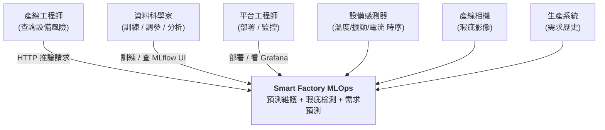
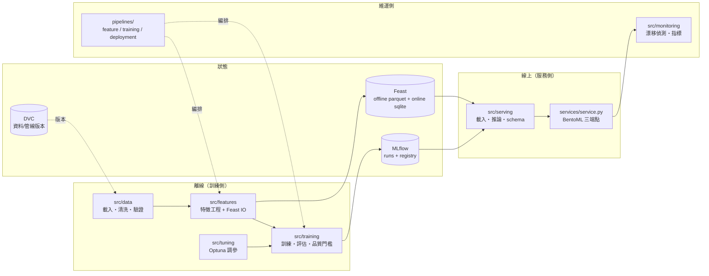
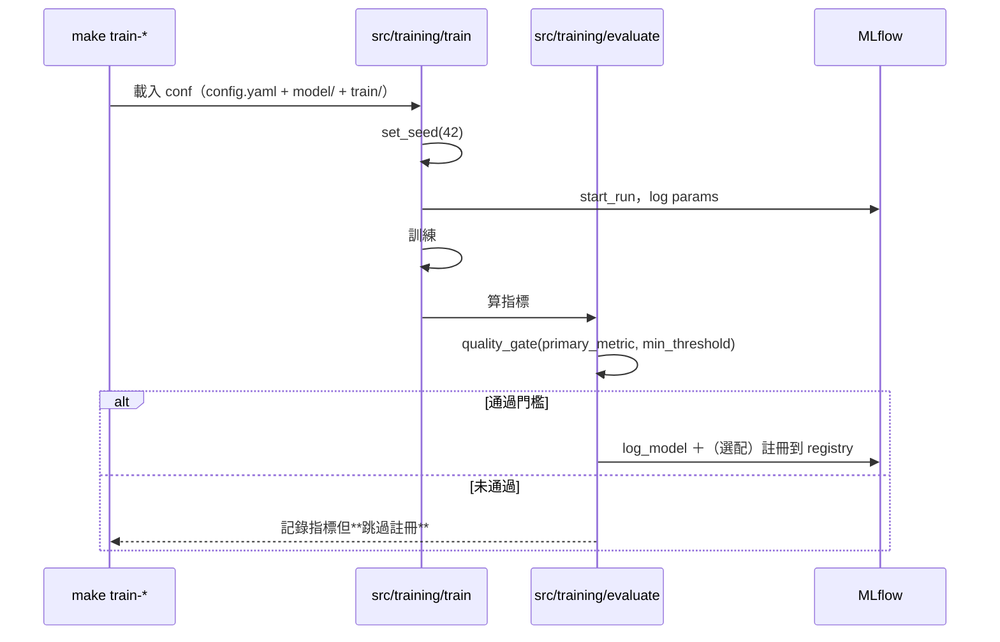
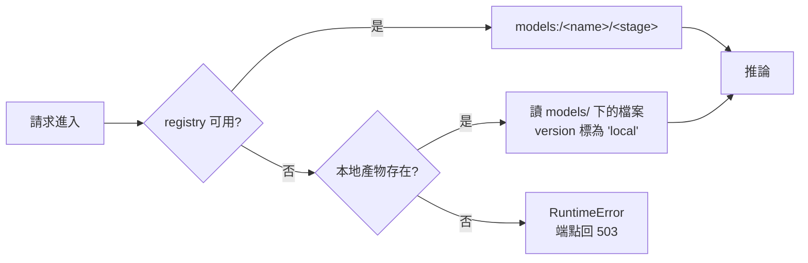
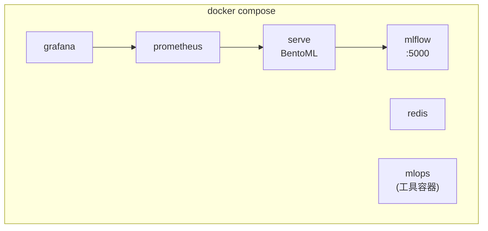

# 軟體架構文件 (SAD) — Smart Factory MLOps

> **版本:** v1.0 | **更新:** 2026-08-03 | **狀態:** 草稿
> **Owner:** Capstone 維護者
> **語域:** L2（橋接）
>
> **定位**：系統級架構的單一真實來源——組成、邊界、資料流、部署視圖。回答「系統由哪些 runtime 組成、邊界在哪、為什麼」。
> 決策理由歸 [`adr/`](adr/)；對外 API 契約歸 [`../design/api_spec.md`](../design/api_spec.md)；模組內部實作以 `src/` 的 docstring 為準。
> **實例:** 單例

## 目錄

- [1. 系統脈絡（C4 L1）](#1-系統脈絡c4-l1)
- [2. 容器與模組邊界（C4 L2–L3）](#2-容器與模組邊界c4-l2l3)
- [3. 技術選型](#3-技術選型)
- [4. 三條資料型態主線](#4-三條資料型態主線)
- [5. 關鍵流程](#5-關鍵流程)
- [6. 資料架構](#6-資料架構)
- [7. 部署視圖](#7-部署視圖)
- [8. 跨領域考量](#8-跨領域考量)
- [9. 風險與演進](#9-風險與演進)

---

## 1. 系統脈絡（C4 L1）



**邊界說明**：本系統負責「從原始資料到可呼叫的預測」。它**不負責**產線控制、不直接對設備下指令——預測結果交給人或既有 MES 決策。

---

## 2. 容器與模組邊界（C4 L2–L3）



**分層規則（`src/` 的硬邊界）**

| 層 | 職責 | 不可以做的事 |
| :--- | :--- | :--- |
| `src/data` | 讀取、清洗、契約驗證 | 不碰模型、不碰 MLflow |
| `src/features` | 特徵計算、Feast 讀寫 | 不訓練 |
| `src/models/{tabular,timeseries,vision}` | 模型定義與存取（含 ONNX 匯出） | 不決定訓練流程 |
| `src/training` | 訓練迴圈、評估、**品質門檻** | 不定義模型結構 |
| `src/serving` | 載模型、前處理、推論、schema | 不訓練、不寫 registry |
| `src/monitoring` | 漂移、指標 | 不改模型 |
| `src/utils` | config / seed / logging | 不含業務邏輯 |

> **`services/` 與 `src/serving/` 的分工**：`src/serving` 是**可測試的純邏輯**（載入策略、前處理、預測函式）；
> `services/service.py` 只做 BentoML 的殼（宣告端點、把 schema 接上）。這樣推論邏輯能被單元測試，不必起服務。

---

## 3. 技術選型

| 面向 | 選用 | 決策記錄 |
| :--- | :--- | :--- |
| 服務化 | BentoML | [ADR-001](adr/ADR-001-bentoml-as-serving-framework.md) |
| 特徵商店 | Feast（local provider + SQLite online） | [ADR-002](adr/ADR-002-feast-as-feature-store.md) |
| 實驗追蹤 / 資料版本 | MLflow ＋ DVC（**兩者並存**） | [ADR-003](adr/ADR-003-mlflow-and-dvc-split.md) |
| 影像推論格式 | ONNX Runtime（非 TorchScript） | [ADR-004](adr/ADR-004-onnx-for-vision-serving.md) |
| 編排 | Prefect（`pipelines/`） | — |
| 監控 | Evidently ＋ Prometheus/Grafana | — |
| 環境 | uv ＋ `uv.lock`（Python 3.11） | 見 [`../../README.md`](../../README.md) 環境章節 |

---

## 4. 三條資料型態主線

同一套 MLOps 骨幹要能管三種模型，是這個專案存在的理由。

| 子場景 | 資料型態 | 模型 | 產物 | 服務端點 |
| :--- | :--- | :--- | :--- | :--- |
| 設備預測性維護 | 結構化 + 時序 | XGBoost | `models/tabular/model.xgb` | `predict_maintenance` |
| 產線瑕疵檢測 | 影像 | ResNet → ONNX | `models/vision/model.onnx` | `predict_defect` |
| 產能需求預測 | 時序 | LSTM | `models/timeseries/` | 未開放端點 |

切換靠設定不靠改碼：`conf/config.yaml` 的 `active_model`，對應 `conf/model/<name>.yaml`。

---

## 5. 關鍵流程

### 5.1 訓練 → 註冊（含品質門檻）



門檻邏輯（`src/training/evaluate.py`）：`rmse/mae/mse` 用 `<=` 判定，其餘用 `>=`；
**主指標缺失時直接判不通過**（fail-safe，不會因為忘了算指標而放行）。

### 5.2 推論時的模型解析



這個回退是**刻意的**：教學/離線環境沒有 registry 也要能 demo。代價是 `model_version` 會變成 `local`，
生產環境應把它視為告警訊號——見 [runbook](../ops/runbook-serving-degraded.md)。

---

## 6. 資料架構

**沒有關聯式資料庫。** 持久化只有三處，都是檔案或 SQLite：

| 儲存 | 內容 | 位置 | 版本控制 |
| :--- | :--- | :--- | :--- |
| 原始 / 中繼 / 特徵資料 | csv、parquet | `data/{raw,interim,processed,external}` | **DVC** |
| Feast offline store | 特徵 parquet | `feature_repo/data/` | DVC |
| Feast online store | 最新特徵 | `feature_repo/data/online_store.db`（SQLite） | 不版控（可重建） |
| MLflow backend | runs / metrics / registry | `mlflow.db`（SQLite，預設） | 不版控 |
| MLflow artifacts | 模型檔 | `mlartifacts/` | 不版控 |

**資料流的時間正確性**：訓練集一律經 Feast `get_historical_features` 做 point-in-time join，
避免特徵穿越到標籤時刻之後。這是本專案最容易被忽略、也最致命的一條規則
（示範見課程 m3 的 [`02_leakage_viz.ipynb`](../../../../modules/m3-feature-store/sandbox/02_leakage_viz.ipynb)）。

DVC 管線的四個 stage（`dvc.yaml`）：

```
prepare → features → train → evaluate(metrics)
```

`dvc repro` 會依 deps/outs 判斷哪些要重跑，`evaluate` 產出的 metrics 進版本控制，讓「這版程式碼對應這個分數」可追溯。

---

## 7. 部署視圖

**兩個映像，刻意分開**（`docker/`）：

| 映像 | 基底 | 內容 | 大小 |
| :--- | :--- | :--- | :--- |
| `Dockerfile.train` | `python:3.11-slim` | 訓練全套（含 torch、onnx、onnxscript） | ~6.9 GB |
| `Dockerfile.serve` | `python:3.11-slim`（multi-stage） | **只有推論**：bentoml + onnxruntime + xgboost，**無 torch** | ~1.9 GB |

分開的理由：推論容器背著訓練依賴會讓冷啟動變慢、攻擊面變大。
兩份 `requirements-*.txt` 皆由 `uv.lock` 產生，所以「本機 / 訓練映像 / 服務映像」三者版本一致。

**本地平台（`make up` → `docker/docker-compose.yml`）**



`infra/terraform/` 目前只有 README，**沒有可用的 IaC**——雲端部署尚未實作。

---

## 8. 跨領域考量

| 面向 | 現況 |
| :--- | :--- |
| **可重現性** | 全域 seed（`src/utils/seed.py` 套用到 random/numpy/torch）＋ `uv.lock` 鎖環境 ＋ DVC 鎖資料 |
| **設定管理** | `conf/config.yaml` 為單一事實來源，`src/utils/config.py` 統一載入；環境變數可覆蓋（如 `MLFLOW_TRACKING_URI`） |
| **輸入驗證** | 所有外部輸入先過 Pydantic schema（`src/serving/schemas.py`），含數值範圍（溫度 -50~500、振動/電流 ≥0）與批次上限 1000 筆 |
| **秘密管理** | `.env` 不進 Git（`.env.example` 為範本）；CI 有 detect-secrets |
| **治理** | Model Card ×2、Datasheet、EU AI Act 風險自評，見 [`../../governance/`](../../governance/) |
| **可觀測性** | 服務指標 → Prometheus/Grafana；資料漂移 → Evidently 報告 |

---

## 9. 風險與演進

| 風險 | 影響 | 現況 / 緩解 |
| :--- | :--- | :--- |
| **canary 探測是佔位** | 部署管線的 promote 決策不可信 | 已記錄於 [ADR-005](adr/ADR-005-deployment-placeholders.md)，接真實流量探測前不可用於生產 |
| **無 IaC** | 環境靠手動 compose，無法一鍵複製到雲端 | `infra/terraform/` 待實作 |
| **玩具資料** | 指標無業務意義（vision 的 f1 常為 0） | 品質門檻會正確擋下註冊，行為是對的；接真實資料是 Capstone 練習 |
| **online store 用 SQLite** | 無法水平擴展、無高可用 | 教學規模足夠；生產需換 Redis/DynamoDB（compose 已預留 redis） |
| **概念漂移偵測不到** | 模型悄悄失效 | Evidently 只抓得到 covariate drift；label 回流機制未建，見 [runbook](../ops/runbook-drift-alert.md) |
