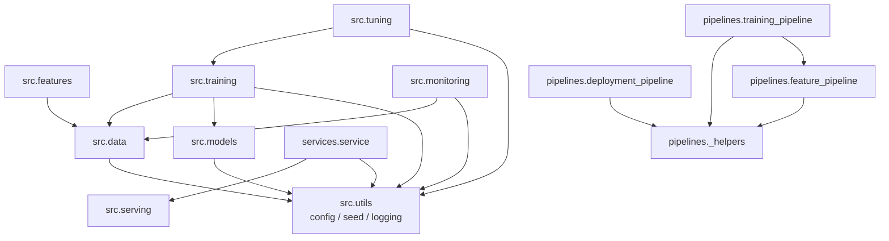
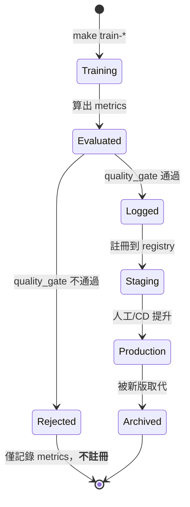
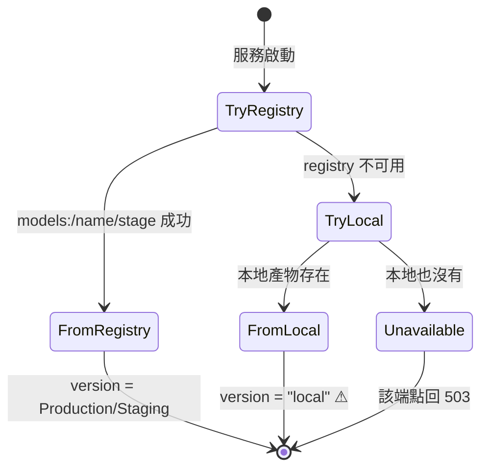
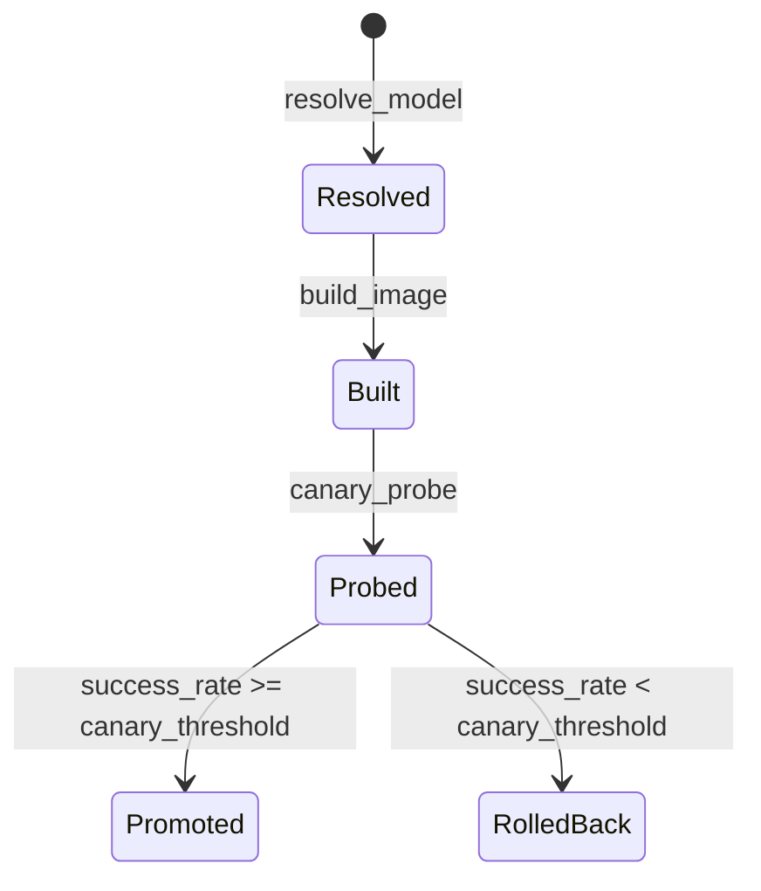

# 低階設計與程式碼地圖 (LLD / Code Map) — Smart Factory MLOps

> **版本:** v1.0 | **更新:** 2026-08-03 | **狀態:** 草稿
> **Owner:** 架構師維護 §5 狀態機（設計契約）；§2–§4 為 AS-BUILT 生成物
> **語域:** L3（工程）
>
> **定位**：C4 Code 層——模組結構、檔案依賴、關鍵資料結構、狀態機。回答「codebase 長什麼樣、誰依賴誰」。
> 系統級架構歸 [`../architecture/sad.md`](../architecture/sad.md)；API 契約歸 [`api_spec.md`](api_spec.md)；
> 決策理由歸 [`../architecture/adr/`](../architecture/adr/)。
> **實例:** 單檔（本專案 Aggregate 數量少，§5 不需拆檔）

## 目錄

- [1. 生成資訊](#1-生成資訊)
- [2. 模組結構](#2-模組結構)
- [3. 模組依賴圖](#3-模組依賴圖)
- [4. 關鍵資料結構](#4-關鍵資料結構)
- [5. 狀態機（設計契約）](#5-狀態機設計契約)
- [6. 錯誤處理策略](#6-錯誤處理策略)
- [7. 追溯](#7-追溯)

---

## 1. 生成資訊

§2–§4 描述**程式碼現況（AS-BUILT）**，過期即重掃。

| 項目 | 值 |
| :--- | :--- |
| 對應 commit | `1908b66` |
| 掃描範圍 | `src/`、`pipelines/`、`services/` |
| 檔案數 | 39 個 `.py`（不含 `__pycache__`） |
| 生成方式 | `ast` 解析每個檔案的 `Import` / `ImportFrom`，聚合到套件層級 |

**重新生成依賴圖**：

```bash
python3 - <<'EOF'
import ast, pathlib, collections
edges = collections.defaultdict(set)
for r in ["src", "pipelines", "services"]:
    for f in pathlib.Path(r).rglob("*.py"):
        if "__pycache__" in str(f): continue
        mod = ".".join(str(f.with_suffix("")).replace("/", ".").replace(".__init__", "").split(".")[:2])
        for n in ast.walk(ast.parse(f.read_text())):
            names = [n.module] if isinstance(n, ast.ImportFrom) and n.module else \
                    ([a.name for a in n.names] if isinstance(n, ast.Import) else [])
            for name in names:
                if name.split(".")[0] in ("src", "pipelines", "services"):
                    t = ".".join(name.split(".")[:2])
                    if t != mod: edges[mod].add(t)
for k in sorted(edges): print(f"{k:26} -> {', '.join(sorted(edges[k]))}")
EOF
```

> 本文件的 §3 就是這段指令的輸出。**不要手工改圖後宣稱它是現況**——改了就重跑。

---

## 2. 模組結構

```text
src/
├── data/          # 載入、清洗、資料契約驗證
├── features/      # 特徵計算與 Feast 讀寫
├── models/        # 模型定義與存取（tabular / timeseries / vision）
├── training/      # 訓練迴圈、評估、品質門檻
├── tuning/        # Optuna 超參搜尋
├── serving/       # 模型載入、前處理、推論、schema
├── monitoring/    # 漂移偵測、指標
└── utils/         # config / seed / logging（無業務邏輯）

pipelines/         # Prefect 編排（feature / training / deployment）
services/          # BentoML 服務外殼
```

| 模組 | 職責（單一） | 對應 SAD 元件 |
| :--- | :--- | :--- |
| `src/data` | 讀取原始資料、清洗、契約驗證 | 離線・資料層 |
| `src/features` | 特徵計算、Feast offline/online IO | 離線・特徵層 |
| `src/models/*` | 模型結構與存取（含 ONNX 匯出） | 離線・模型層 |
| `src/training` | 訓練、評估、**品質門檻判定** | 離線・訓練層 |
| `src/tuning` | Optuna study 與目標函式 | 離線・調參 |
| `src/serving` | **純推論邏輯**（可單元測試，不依賴框架） | 線上・服務層 |
| `src/monitoring` | 漂移報告、線上指標 | 維運層 |
| `src/utils` | 設定載入、seed、logging | 跨層 |
| `pipelines` | 把上述模組編成 flow | 維運・編排 |
| `services` | BentoML 端點宣告（**只有殼**） | 線上・API |

---

## 3. 模組依賴圖

實際掃描結果（套件層級，`src.serving` 內部互相 import 不畫）：



**三個值得注意的性質**

1. **無循環依賴**（腳本已驗證）。`src.utils` 是唯一的葉節點，被多數模組依賴但不依賴任何人——設定與 seed 是跨層基礎設施，這個方向是對的。

2. **`src.serving` 不依賴任何其他 `src` 套件。** 它只 import 自己的 `model_loader` / `predict` / `schemas`。
   這是刻意的：**推論路徑不應該把訓練期的程式碼拖進生產容器**。
   也因此 `Dockerfile.serve` 能只裝推論依賴而不裝 torch（見 [ADR-004](../architecture/adr/ADR-004-onnx-for-vision-serving.md)）。

3. **`services.service` 只依賴 `src.serving` 與 `src.utils`。**
   換掉 BentoML 時要改的只有 `services/`，推論邏輯不動——這是 [ADR-001](../architecture/adr/ADR-001-bentoml-as-serving-framework.md) 所說「不被框架綁死」的具體落實。

**一個要注意的空缺**：`src.training` **不依賴** `src.features`。
訓練讀的是已經產好的特徵檔（由 `pipelines.feature_pipeline` 或 DVC 的 `features` stage 產出），
兩者透過**檔案**而非 import 耦合。好處是階段可獨立重跑；代價是**特徵欄位的契約沒有型別檢查**，
只能靠 `tests/data/test_expectations.py` 的命名測試守住。

---

## 4. 關鍵資料結構

程式碼裡有明確定義的結構才列；一般 dict / DataFrame 不列。

### 4.1 跨層契約

| 結構 | 定義位置 | 不可變 | 用途 |
| :--- | :--- | :---: | :--- |
| `AppConfig` | `src/utils/config.py` | ✓ frozen | 設定的型別化視圖，`load_config()` 產出 |
| `GateResult` | `src/training/evaluate.py` | ✓ frozen | 品質門檻判定結果 |
| `TrainArtifacts` | `src/training/_trainers.py` | dataclass | 訓練產出（模型名、params、metrics、artifact 路徑） |
| `PredictionMetrics` | `src/monitoring/metrics.py` | — | 線上預測指標 |

`GateResult` 是**設計上刻意 frozen** 的：判定結果一旦產生就不該被下游改寫。

```python
@dataclass(frozen=True)
class GateResult:
    passed: bool
    metric: str
    value: float
    threshold: float
    direction: str  # "maximize" | "minimize"
```

### 4.2 API 邊界（Pydantic）

`src/serving/schemas.py` 的 7 個 model，欄位約束見 [`api_spec.md`](api_spec.md)：

```
SensorReading → MaintenanceRequest ─┐
                                    ├→ MaintenanceResponse ← MaintenancePrediction
DefectPrediction → DefectResponse
HealthResponse
```

### 4.3 模型類別

| 類別 | 位置 | 說明 |
| :--- | :--- | :--- |
| `LSTMForecaster` | `src/models/timeseries/model.py` | 需求預測對外介面 |
| `_LSTMNet` | 同上 | 內部 `nn.Module`，**前綴底線 = 不對外** |

`DataValidationError(ValueError)` — `src/data/validation.py`，資料契約違反時拋出。

---

## 5. 狀態機（設計契約）

**這一節是設計契約，不是 AS-BUILT**：它規定狀態該怎麼流轉，程式碼要遵守它。

### 5.1 模型生命週期（Aggregate：Model）



**轉移規則（不可違反）**

| 轉移 | 條件 | 強制點 |
| :--- | :--- | :--- |
| `Evaluated → Logged` | `GateResult.passed == True` | `src/training/evaluate.py` |
| `Evaluated → Rejected` | 門檻未過**或主指標缺失** | 同上（缺失時 fail-safe 判不通過） |
| `Rejected → *` | **無出口**。不得繞過門檻直接註冊 | 見 [runbook](../ops/runbook-quality-gate-failure.md) |
| `Staging → Production` | 需人工或 CD 決策 | MLflow Registry |

> `Rejected` 是終止狀態，這是刻意的。想讓模型上線只有一條路：**把它訓練得夠好**。
> 調低門檻是改變契約，必須有業務理由並更新 Model Card。

### 5.2 服務端模型解析（Aggregate：LoadedModel）

服務**啟動時**（`SmartFactoryService.__init__`）各模型獨立走一次：



**契約**

| 狀態 | `model_version` | `/healthz` | 端點行為 |
| :--- | :--- | :--- | :--- |
| `FromRegistry` | `Production` / `Staging` | 該模型 `true` | 正常 |
| `FromLocal` | **`local`** | 該模型 `true` | 正常但**可能是過期模型**，生產應告警 |
| `Unavailable` | — | 該模型 `false` | 503 `ServiceUnavailable` |

**兩個模型獨立走這個狀態機**，所以會出現「表格正常、影像 503」的部分可用狀態，
此時 `/healthz` 回 `degraded`。

> **重要**：狀態只在**啟動時**決定，執行期不會自動重試。
> registry 修好後必須重啟服務——見 [runbook](../ops/runbook-serving-degraded.md)。

### 5.3 部署決策（Aggregate：Deployment）



> ⚠️ **此狀態機目前不可信**：`canary_probe` 是佔位，回傳寫死的 `1.0`，
> 所以 `Probed → RolledBack` 這條邊**永遠不會被走到**。
> 詳見 [ADR-005](../architecture/adr/ADR-005-deployment-placeholders.md)。

---

## 6. 錯誤處理策略

各層的失敗處置不同，這是刻意的分層設計：

| 層 | 遇錯行為 | 理由 |
| :--- | :--- | :--- |
| `src/data` 驗證 | 拋 `DataValidationError` **中止** | 壞資料進到下游只會產生壞模型，早死早好 |
| `src/training` 門檻 | **不拋例外**，回傳 `GateResult(passed=False)` 並跳過註冊 | 訓練本身沒錯，是結果不夠好；要保留 metrics 當證據 |
| `src/serving` 載入 | 記 warning 後回退，最終失敗才拋 `RuntimeError` | 單一模型失敗不該讓整個服務起不來 |
| `services/service.py` | 模型為 `None` 時拋 `ServiceUnavailable`（503） | 對呼叫端要有明確語意 |
| Pydantic schema | 自動 422 | 邊界驗證，fail-fast |

**一條貫穿的原則**：**沉默的缺席不等於成功。**
品質門檻找不到主指標時判「不通過」而非略過；服務載不到模型時端點回 503 而非回假資料。

---

## 7. 追溯

| 本文件章節 | 上游 | 下游 |
| :--- | :--- | :--- |
| §2 模組結構 | [`sad.md` §2](../architecture/sad.md#2-容器與模組邊界c4-l2l3) | — |
| §3 依賴圖 | [ADR-001](../architecture/adr/ADR-001-bentoml-as-serving-framework.md)、[ADR-004](../architecture/adr/ADR-004-onnx-for-vision-serving.md) | — |
| §5.1 模型生命週期 | [`sad.md` §5.1](../architecture/sad.md#51-訓練--註冊含品質門檻) | [`test_plan.md` §4](../qa/test_plan.md#4-品質門檻自動擋交付)、[runbook](../ops/runbook-quality-gate-failure.md) |
| §5.2 模型解析 | [`sad.md` §5.2](../architecture/sad.md#52-推論時的模型解析) | [`api_spec.md` §5](api_spec.md#5-模型版本語意)、[runbook](../ops/runbook-serving-degraded.md) |
| §5.3 部署決策 | [ADR-005](../architecture/adr/ADR-005-deployment-placeholders.md) | — |
